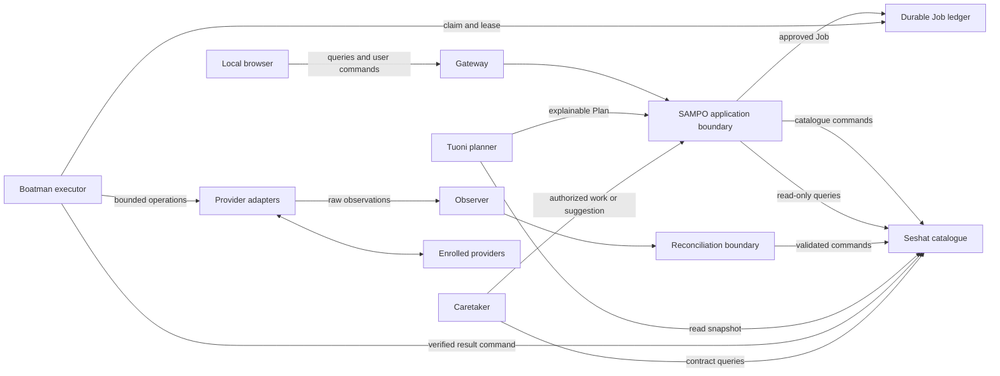
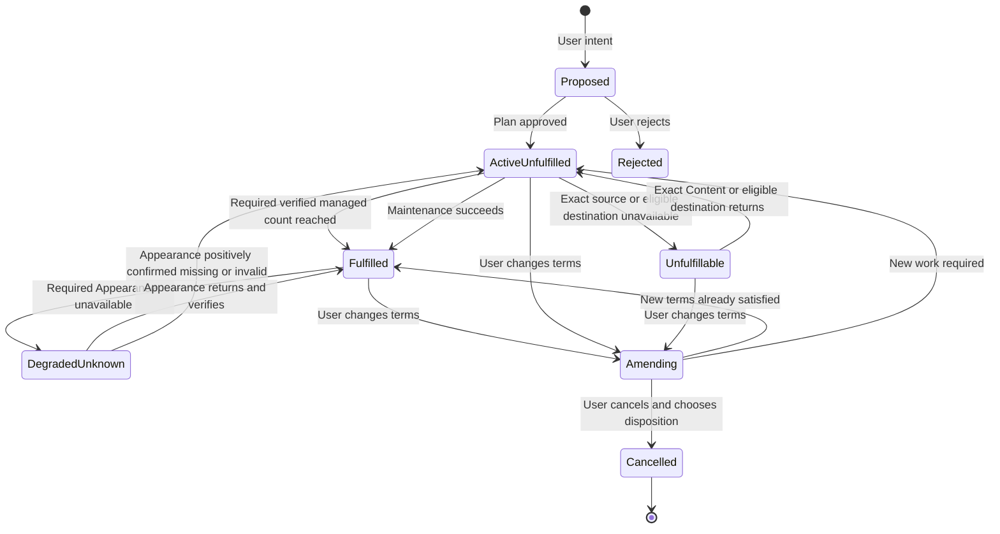
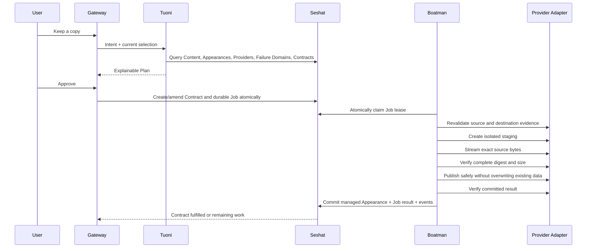
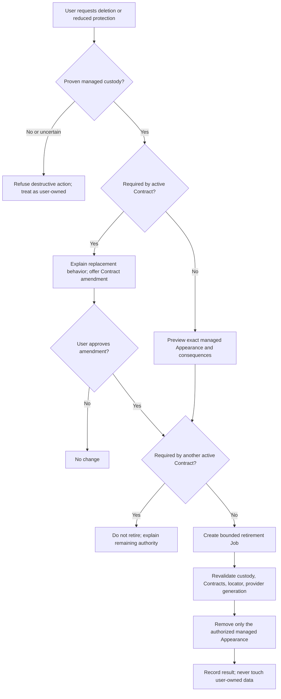
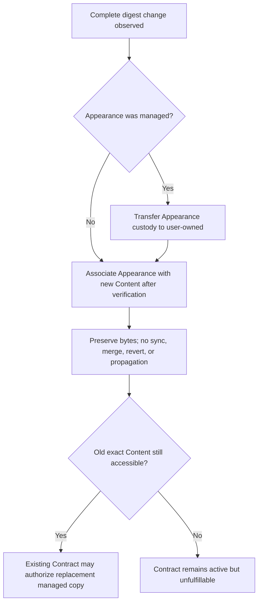
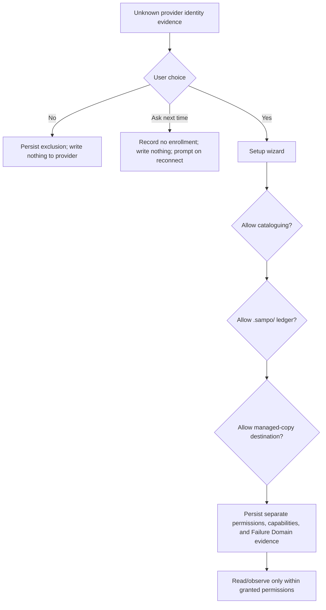

# SAMPO MVP Architecture

**Status:** Architecture proposal implementing the approved product decisions
**Scope:** Documentation only; no language, framework, storage library, database schema, or package layout is selected here.

## 1. Purpose and system boundary

SAMPO is a single-user local application that builds a searchable library over ordinary provider data and maintains user-approved Protection Contracts over exact byte Content.

The MVP proves:

- read-only discovery of user-owned files;
- exact-content recognition across names and providers;
- explicit provider enrollment and portable provider memory;
- local browser search;
- explainable Plans;
- durable, idempotent Jobs;
- verified additive managed copies;
- bounded continuous maintenance authorized by Contracts;
- safe routing to an available Appearance;
- ordinary provider-native byte access without SAMPO.

The MVP does not virtualize blocks, synchronize edits, present a virtual filesystem, expose a public service, infer a revision history, or destructively manage user-owned data.

SAMPO owns orchestration and control-plane state: Provider enrollment, Failure Domain evidence, catalogue knowledge, custody evidence, Projects, Protection Contracts, Plans, Jobs, observations, and audit history. It does not own user bytes merely because it observes or coordinates them. Byte custody remains an explicit property of each Appearance.

### One application, explicit modules

All responsibilities run inside one local application. Module boundaries express authority and dependency direction, not deployment topology. Direct in-process queries and commands are allowed. Domain events are durable committed facts, not an asynchronous backbone for correctness.



## 2. Authority model

### Five different kinds of information

| Kind | Meaning | Authority |
|---|---|---|
| Raw Observation | Untrusted report about external reality. | Evidence only; cannot establish custody, fulfill a Contract, or authorize deletion. |
| Catalogue Fact | A reconciled statement accepted by Seshat with evidence and confidence. | Current SAMPO control-plane truth, subject to later observations. |
| User Intent | A requested outcome such as **Keep a copy**. | Input to planning, not permission for arbitrary work. |
| Plan | Explainable proposed implementation of intent or a materially changed action. | No execution authority until approved. |
| Approved Job | Durable bounded work derived from a Contract or explicit approval. | Boatman may perform only the recorded operations and preconditions. |
| Domain Event | Immutable record that an authoritative state change committed. | History and integration evidence; not a command. |

### Exclusive authoritative writer

Seshat owns authoritative catalogue state. Other modules change it only through validated catalogue commands. This does not require a separate service; it requires one transactional authority boundary.

An external provider remains authoritative about its actual bytes. Seshat records evidence about those bytes but does not make them exist by assertion. When catalogue and provider disagree, the state is uncertain until reconciled.

### Custody

Custody is per Appearance:

- **User-owned:** default for pre-existing, externally created, ambiguously proven, externally edited managed, or explicitly handed-over data.
- **Managed:** proven output of an approved SAMPO Job or explicit adoption.

Paths, directories, `.sampo/` proximity, names, and provider enrollment never establish custody by themselves.

## 3. Staff responsibilities

### Gateway

- **Owns:** local browser session boundary, request validation, presentation translation.
- **May read:** query projections intended for the current local user.
- **May change:** nothing directly; submits bounded commands.
- **Never:** writes catalogue storage, accesses providers, invents Plans, or exposes a non-loopback listener by default.
- **Input/output:** local HTTP requests; rendered/search responses; command acceptance, Plan preview, Job status.
- **Failure:** reject invalid, oversized, cross-origin, expired-session, or timed-out requests without state change.
- **Approval:** collects explicit approval for new Contracts, material Plan changes, adoption, amendment, and managed retirement.
- **Contract authority:** none beyond faithfully transmitting already approved user action.

### Observer

- **Owns:** acquisition of provider watcher, scan, and reconnect evidence.
- **May read:** enrolled provider state within granted permissions; provider-local ledger as untrusted evidence.
- **May change:** observation/checkpoint records through bounded ingestion; provider-local scan checkpoint only when enrollment permits.
- **Never:** declares truth, establishes custody, creates Contracts, repairs copies, deletes data, or acts on disappearance.
- **Input/output:** adapter reports to immutable raw Observations.
- **Failure:** records partial scan, unavailable provider, lost notification cursor, or uncertain result; does not fabricate absence.
- **Approval:** provider enrollment and observation permissions precede access or `.sampo/` writes.
- **Contract authority:** none.

### Seshat

- **Owns:** reconciled Providers, Failure Domains and their evidence, Content, Appearances, custody, Projects, Contracts, Plans, Jobs, Catalogue Facts, verification state, and audit history.
- **May read:** durable input evidence and provider results presented through commands.
- **May change:** authoritative catalogue state transactionally after validating invariants and preconditions.
- **Never:** moves bytes, performs provider I/O, invents observations, or treats a planned/staged copy as verified.
- **Input/output:** queries; validated commands; durable domain events committed with state.
- **Failure:** rejects the whole command or commits it atomically. Suspected corruption enters read-only safe mode.
- **Approval:** records approval evidence; does not manufacture it.
- **Contract authority:** source of current Contract terms and whether a Job is authorized by them.

### Tuoni

- **Owns:** deterministic policy evaluation, capability matching, access routing, and explainable Plan construction.
- **May read:** consistent Seshat snapshots, Provider capabilities, and Failure Domain relationships.
- **May change:** proposed Plans only through commands; no provider or catalogue facts directly.
- **Never:** performs storage I/O, approves its own material changes, establishes custody, or weakens Contract terms to make a Plan succeed.
- **Input/output:** user intent, Contract maintenance need, current facts, capabilities; outputs Plan or explicit unsatisfiable explanation.
- **Failure:** returns no Plan or a clearly unsatisfied Plan; never guesses a provider guarantee.
- **Approval:** new Contract and material changes require user approval.
- **Contract authority:** may plan retry, restoration, verification, and staging already bounded by approved terms.

### Boatman

- **Owns:** execution state for a claimed Job and provider-operation evidence.
- **May read:** immutable Job intent, current preconditions, source evidence, adapter capabilities.
- **May change:** SAMPO-owned staging; authorized managed Appearances; Job lease/progress; verified-result commands.
- **Never:** invents policy, selects a materially new provider, touches user-owned data destructively, overwrites an unknown destination, or counts unverified bytes.
- **Input/output:** approved Job; provider results, digests, committed locator, or structured failure.
- **Failure:** preserves source, isolates partial output, records retryable/final/uncertain failure, and releases or lets its lease expire safely.
- **Approval:** operates without repeated approval only within active Contract terms.
- **Contract authority:** retry, resume, staging cleanup, verification, positively confirmed missing/invalid managed-copy recreation, and restoration of count and Failure Domain constraints within approved terms. Unavailability alone grants no replacement authority.

### Caretaker

- **Owns:** detection of Contract drift and safe maintenance needs.
- **May read:** Contracts, Appearances, Failure Domain relationships, Provider availability, verification age, and Job state.
- **May change:** maintenance suggestions or bounded Job requests through SAMPO.
- **Never:** performs unapproved provider I/O, changes Contract scope, acts on user-owned data, or creates races with active Jobs.
- **Input/output:** catalogue queries to already authorized Job request or user-facing suggestion.
- **Failure:** records deferred/blocked maintenance and tries later within resource limits.
- **Approval:** none for work already authorized; required for material change.
- **Contract authority:** exactly the active Contract, no broader optimization mandate.

## 4. Minimum domain model

### Provider

A registered storage resource with stable internal identity, class, persistent identity evidence, enrollment/exclusion state, capabilities, availability, permissions, routing hints, cost hints, and evidence linking it to relevant Failure Domains. Provider identity is never Content or Failure Domain identity.

### Failure Domain

An explicitly represented loss boundary that may affect one or more Providers or storage instances together. Examples include a physical disk, enclosure, host, network dependency, service, account, or another approved durability boundary.

Failure Domain relationships have evidence and confidence. They may overlap or contain one another. Different Providers are not presumed independent, and unknown independence is not sufficient for an unconstrained multi-copy Contract.

For Contract evaluation, each qualifying managed Appearance must be a distinct committed storage instance and must contribute an independent approved Failure Domain. Aliases, hard links, mount aliases, or multiple Provider abstractions over the same underlying storage do not manufacture independence.

### Content

One exact byte sequence recognized by a complete verified digest. It has a stable internal ID, digest algorithm and value, size, type hints, and verification history. The digest need not be its internal primary identity; digest-algorithm migration must remain possible.

### Appearance

One occurrence of Content at one Provider and opaque locator. It records names, custody, availability, verification, observation history, native identity evidence, and staged/committed/missing/changed/uncertain status.

An Appearance record does not make bytes exist. Only positive provider evidence can establish availability.

### Project and membership

A Project is an overlapping logical collection. Membership relates a Project to Content and carries observation/action history. It has no byte-moving semantics.

### Protection Contract

A persistent approved obligation over exact Content. It records required minimum managed-copy count, required Failure Domain independence, any explicitly approved same-domain exception, approved Provider/cost/locality constraints, current protection assessment, amendment history, and cancellation disposition.

### Plan

An immutable explainable proposal capturing source facts, intended destination, required space/cost, capability assumptions, Failure Domain evidence, expected safety result, and material differences from current authority. A weaker same-domain alternative must be conspicuous and explicit. Approval either creates/changes a Contract or authorizes a one-off bounded action.

### Job

A durable execution record with stable identity and idempotency key, authority source, immutable operation intent, source evidence, destination, capability assumptions, preconditions, claim/lease, staging, verification, retries, cancellation, result, and audit evidence.

### Observation and Catalogue Fact

An Observation is immutable untrusted evidence with Provider, source cursor or scan identity, observation time, native identity hints, and claimed state. A Catalogue Fact is the reconciled interpretation Seshat accepts, with its evidence and confidence.

### Domain Event

An immutable record of a committed catalogue transition. At minimum it identifies aggregate/entity, transition, time, cause, command/Job/Observation provenance, and resulting version. Exact storage representation is deferred.

## 5. Provider capability boundary

Capabilities describe guarantees and constraints, not just feature names. Each declaration states support, atomicity scope, consistency, name rules, size limits, cost behavior, and evidence tokens where relevant.

| Capability | Filesystem interpretation | Object-storage interpretation | If absent |
|---|---|---|---|
| Enumerate | Directory traversal | Prefix/key listing with continuation | No general discovery; known-locator operation only. |
| Stat | Metadata and stable file evidence | HEAD/metadata and generation evidence | Read bytes to verify where possible; otherwise unknown. |
| Read | Open immutable snapshot or guarded stream | Get object/generation | Appearance cannot satisfy accessible-copy requirements. |
| Stage/write | Temp file isolated from final name | Unique key or multipart upload | Provider cannot be destination. |
| Atomic publish | Atomic rename/create-if-absent when proven | Conditional create/publication when semantics support it | Provider is read-only for managed publication in the MVP; uniqueness guesses do not replace an atomic no-overwrite guarantee. |
| Remove managed data | Delete proven managed file | Delete proven managed object/version | Retirement unavailable. Contract planning must account for it. |
| Server-side copy | Native copy/reflink only when its equality and isolation semantics are proven | Provider-native copy with explicit source generation and result verification | Stream through a trusted reader/writer path if supported; otherwise no copy Plan. |
| Native versioning | Filesystem snapshots or generations where exposed | Object versions/generations | SAMPO retains its own Content and Appearance semantics; native history is optional evidence. |
| Preserve timestamps | Native timestamp preservation where permitted | User metadata or provider-native timestamps | Report fidelity loss; never fabricate preservation. |
| Preserve names/hierarchy | Hierarchical names subject to platform rules | Key mapping without true directory semantics | Use an explicit reversible name mapping or report the Plan unsatisfiable. |
| Content addressing | Provider may expose digest-based storage | Key may be derived from a digest | Treat as an optimization only; Provider locator and digest never replace Content identity or custody. |
| Conditional mutation | File identity/generation precondition | Version/ETag precondition with documented semantics | Never replace; require proven create-new semantics or refuse managed mutation. |
| Leases/locks | Native advisory or mandatory coordination | Provider lock/lease facility | Core Job leases still apply; provider writes must remain create-new and idempotent. |
| Native identity | File ID and volume identity | Key plus version/generation | Rename inference weakens; identity remains uncertain. |
| Integrity evidence | Size, reread digest | Own digest metadata or reread | SAMPO full digest remains required. ETag alone is insufficient. |
| Notifications | Watcher/journal | Provider notifications where available | Poll if enumeration exists. |
| Free space/cost | Volume capacity | Quota and transfer/storage cost hints | Plan reports unknown and avoids unsupported promises. |
| Availability/health | Mount and operation evidence | Endpoint and operation evidence | State is unknown, not missing. |
| Removable/intermittent operation | Explicit mount/device lifecycle | Endpoint or credential availability may be intermittent | Preserve Contract and Appearance history; unavailability is not deletion. |
| Consistency | Usually immediate but not assumed | May be eventual | Use settle windows/direct checks; negative listings are not final evidence. |

Core behavior is capability-driven. A missing capability makes a Plan unsatisfiable or selects a safe alternative; it never silently degrades a guarantee.

Global domain records carry Provider ID plus opaque locator. Filesystem paths and object keys remain provider-native locator representations and are never Content IDs.

## 6. Protection Contract lifecycle



Contract state is derived from current reconciled facts and active Jobs; it does not cancel itself when reality is unfavorable.

An unconstrained required count of two means at least two distinct, verified, committed managed Appearances across two independent Failure Domains. Different Providers are insufficient evidence by themselves. If only same-domain placement is available, the Contract remains unfulfilled unless the user explicitly approves that weaker term.

Protection reporting separates:

- required minimum managed count;
- verified available managed Appearances and independent Failure Domains;
- known but unavailable and currently unverifiable managed Appearances;
- positively confirmed missing or invalid Appearances;
- surplus managed Appearances.

Planned, staging, partial, user-owned, digest-mismatched, or duplicate references to one storage instance do not count. An unavailable Appearance does not count as currently verified available, but it is not treated as missing and does not trigger replacement. Surplus above the minimum is reported and retained until an explicit Contract amendment authorizes retirement.

## 7. Observation and reconciliation flow

```mermaid
sequenceDiagram
    participant P as Provider Adapter
    participant O as Observer
    participant R as Reconciler
    participant S as Seshat
    participant C as Caretaker

    P->>O: Scan, watcher, reconnect, or operation evidence
    O->>S: Append immutable Raw Observation
    R->>S: Query prior facts and related evidence
    R->>P: Optional direct verification
    alt Evidence is sufficient
        R->>S: Command proposed fact transition
        S->>S: Validate and commit fact + domain event
        S-->>C: Contract state now requires attention
    else Evidence conflicts or is incomplete
        R->>S: Mark uncertain/conflicting; preserve prior history
    end
```

Rules:

- A negative listing never directly deletes an Appearance.
- Provider unavailability is not Appearance deletion.
- An unavailable managed Appearance remains known but currently unverifiable; reconciliation must not request replacement without positive missing/invalid evidence.
- A changed digest detaches the Appearance from old Content and associates it with new Content only after complete verification.
- A managed Appearance changed externally transfers to user custody before Contract evaluation.
- Rename continuity uses provider-native identity first, then unambiguous complete-hash evidence, otherwise uncertainty.
- Provider-local `.sampo/` history is evidence, not truth.
- Reconciliation is idempotent: replaying an Observation cannot duplicate Content, Appearances, or events.

## 8. Copy creation and verification flow



### Transfer safety protocol

1. Persist Job before provider writes.
2. Derive idempotency from operation, Content, destination Provider, Contract/Plan version, and intended managed role.
3. Claim atomically with a renewable lease.
4. Revalidate source digest/generation, destination capability revision, Contract authority, Failure Domain evidence, cancellation, cost, and space evidence.
5. Stage under a unique SAMPO-owned locator. Never truncate or replace an existing destination.
6. Hash while transferring and verify staged bytes completely.
7. If the final locator exists:
   - adopt only if provenance/custody permits and exact bytes independently verify;
   - otherwise report collision and do not overwrite.
8. Publish atomically or by safe create-new semantics. A provider that exposes incomplete committed data is not an eligible destination.
9. Verify the committed locator independently.
10. Only then create the managed Appearance and count it toward the Contract.
11. Recover a crash after provider commit by finding/verifying the idempotent result and finalizing Seshat; never blindly repeat an overwrite.

Cancellation is final only before provider commit. After commit, SAMPO must reconcile the actual result. Removing a committed managed Appearance is a separate authorized Job.

## 9. Managed deletion and Contract amendment



A simple **delete this managed appearance** request does not change a Contract. If the Contract still requires it, Caretaker will recreate it. Permanent reduction therefore begins with explicit amendment or cancellation.

Deletion failure is not success. Ambiguous provider results produce `NeedsAttention`; no catalogue fact claims absence until reconciled.

## 10. External-edit flow



Minimal directly witnessed `derived-from` history is optional. It cannot affect equality, Contract fulfillment, or automatic synchronization.

## 11. Provider enrollment flow



Enrollment does not adopt existing files or grant destructive authority. Provider recognition uses persistent evidence where available and remains uncertain when clones or remounts cannot be distinguished safely.

## 12. Access routing

Routing is per operation and does not change custody or authority.

### Open/read

Candidate Appearances must match exact Content and be verified and available. Tuoni broadly prefers:

1. Fast local filesystem Appearance.
2. Other local filesystem Appearance.
3. Local-network mounted Appearance.
4. S3-compatible Appearance.

Actual ranking may consider current availability, expected latency, operation cost, and user constraints. Unavailable or uncertain Appearances remain visible but are not attempted blindly.

### Edit

Prefer a writable user-owned local Appearance. A managed preservation Appearance is not the default editable target. If none exists, present a clear action to create a new user-owned working Appearance, verify its initial bytes, transfer it to user custody, and open that copy.

### Provider-oriented action

Sharing, export, or remote retrieval may deliberately select an otherwise lower-ranked remote Appearance. The UI explains the choice.

## 13. Security boundary

- Gateway listens on loopback only by default.
- No LAN/public fallback is permitted when loopback binding fails.
- Every state-changing request requires a valid local browser session and request-forgery defense selected by a later implementation ADR.
- Origin/host validation, body-size limits, header/read/write/idle timeouts, and bounded concurrent work are required.
- Browser content treats provider names, file names, metadata, and errors as untrusted display data.
- Provider credentials live in Windows Credential Manager under the accepted implementation ADR; never in ordinary files or per-file visible metadata.
- Logs and audit views redact secrets and do not expose arbitrary local Content.
- Provider operations execute with the operating-system user’s permissions and never claim to bypass native ACLs.
- No accounts, roles, remote administration, public API, or multi-user authorization exist in the MVP.

## 14. Failure handling and recovery

| Failure | Required behavior |
|---|---|
| Process crash before Job claim | Job remains queued. |
| Worker crash with lease | Lease expires; recovery revalidates before retry. |
| Crash during staging | Partial staging is isolated and not contract-satisfying; resume, verify, or clean safely. |
| Crash after provider commit before Seshat finalization | Reconcile idempotency evidence, verify committed bytes, and adopt exactly once. |
| Duplicate workers | Atomic claim plus provider-safe idempotency yields one authoritative result. |
| Source changes | Abort stale Job; record Observation; never label changed bytes as planned Content. |
| Destination exhaustion | Preserve source and existing destination; Job becomes retryable or requires replanning. |
| Destination collision | Verify same-content candidate only when safe; otherwise stop without overwrite. |
| Provider disconnect | Mark unavailable/unknown, retain Job and Contract, and resume after revalidation. |
| Required managed Appearance unavailable | Report it as known but currently unverifiable. Do not create a replacement until positive missing/invalid evidence exists. |
| Two Providers share one Failure Domain | Count only the independent domains allowed by the Contract. Leave an unconstrained Contract unfulfilled or present an explicit weaker Plan for approval. |
| Surplus managed Appearances exist | Report them; do not automatically retire them or reinterpret the required minimum as an exact target. |
| Eventual-consistency negative result | Remain unknown during provider settling rules; absence alone cannot authorize deletion. |
| Provider-local ledger loss | Rescan; preserve byte access; uncertain custody becomes user-owned. |
| Home catalogue loss | Rebuild only proven evidence; no destructive operation until custody and Contracts are re-established. |
| Catalogue corruption | Enter read-only safe mode and restore/rebuild; do not execute Jobs. |
| Managed Appearance externally edited | Preserve new Content, transfer to user custody, repair old Contract only from exact remaining source. |
| Managed Appearance externally deleted | Keep Contract active and recreate within approved terms where fulfillable. |
| User-owned Appearance disappears | Record unavailable/missing only after reconciliation; never recreate or delete anything unless a Contract independently authorizes managed work. |

### Job states

At minimum the architecture must distinguish proposed, queued, claimed, running, staged, verified, provider-committed, succeeded, retryable failure, terminal failure, cancellation requested, cancelled, and needs attention. Exact names are an implementation choice; losing these semantic distinctions is not.

## 15. Provider-local memory

The `.sampo/` control area exists only on providers enrolled with permission. Its internal representation is deliberately unspecified.

It may preserve:

- provider identity evidence and schema/version information;
- installation attribution;
- scan and notification checkpoints;
- locally known Appearance and digest evidence;
- custody provenance for SAMPO-created copies;
- compact reconnect history.

It must not:

- be required to decode committed Content;
- silently claim custody over surrounding files;
- contain provider credentials;
- be trusted over current provider reality;
- act as a distributed write-consensus log;
- turn loss into permission to delete or overwrite.

## 16. Managed filesystem layout

Each enrolled filesystem Provider reserves two distinct roots:

- `library/` contains committed SAMPO-managed Appearances as ordinary readable files. A new managed copy starts with the first user-approved human-readable relative path and preserves the source extension. A later source rename changes catalogue evidence, not the committed managed path.
- `.sampo/` contains machine metadata and SAMPO-owned staging. It is never required to decode committed Content and never establishes custody over neighbouring files.

Sanitization and collision handling must be deterministic, readable, and Provider-aware. Publication may add a readable disambiguator but may never overwrite an existing destination. A file merely placed under `library/` remains user-owned.

## 17. Adoption flow

Observer reports an unproven file in managed space as a raw Observation. Seshat records user custody and Gateway offers a durable choice:

- **Adopt:** revalidate and hash the Appearance, show any applicable Contract association, obtain explicit approval, then commit custody and audit evidence transactionally. If the bytes change before commit, adoption stops and requires a refreshed decision.
- **Leave it mine:** retain user custody and suppress the same prompt for that observed generation unless it materially changes.
- **Ask later:** retain user custody and preserve the prompt for later review.

No path, scan, watcher event, or Provider-ledger claim can perform adoption by itself.

## 18. Factual Provider usage

Provider adapters may report measured byte counts, operation counts exposed by the Provider, transfer history, quota responses, last successful operations, and provider/billing failures. Seshat stores these as dated facts or observations with their source.

SAMPO does not estimate currency bills, enforce Provider budgets, or create per-operation spending approval. Enabling a paid Provider makes it eligible within approved Contract terms; enrollment warns the user to configure Provider-side budgets, quotas, and billing alerts.

## 19. Initial platform topology

The first control plane is a Windows per-user local application with a loopback-only browser UI. It uses the current operating-system user's Provider permissions and does not require a privileged Windows service. Ubuntu Server participates first by hosting the S3-compatible Provider, not by running a second control plane. Linux control-plane support is later, but platform-specific behavior stays behind Provider and host-integration boundaries.

## 20. Implementation milestones

Implementation proceeds through the vertical milestones in `IMPLEMENTATION-MILESTONES.md`:

1. Documentation truth.
2. Read-only filesystem catalogue.
3. Enrollment and portable memory.
4. One verified managed filesystem copy.
5. Continuous Contract maintenance.
6. Local S3-compatible provider.
7. Projects by snapshot.
8. MVP hardening.

Each milestone must remain demonstrable without importing later Parking Lot behavior.

## 21. Acceptance-test mapping

| Architecture area | Acceptance tests |
|---|---|
| Ordinary-file and custody boundary | AT-01, AT-02, AT-07, AT-16, AT-17, AT-22, AT-26, AT-27 |
| Exact Content and Appearances | AT-04, AT-05, AT-06, AT-09 |
| Protection Contract lifecycle | AT-08, AT-09, AT-10, AT-11 |
| Failure Domain independence and copy-count semantics | AT-23, AT-24, AT-25 |
| Access routing | AT-03, AT-12, AT-13 |
| Provider enrollment and portable memory | AT-14, AT-15, AT-16, AT-17 |
| Durable filesystem transfer | AT-03, AT-19, AT-22 |
| S3-compatible transfer | AT-12, AT-20, AT-22, AT-28 |
| Project snapshots | AT-18 |
| Security boundary | AT-21 |
| Factual usage boundary | AT-29 |

All architecture areas are also subject to cross-cutting crash injection, duplicate execution, source mutation, destination collision, provider disconnection, name normalization, request limits, audit explanation, and raw-observation authority tests.

## 22. Accepted implementation decisions

The product owner delegated these choices in `SAMPO-IMPLEMENTATION-ADR-OWNERSHIP.md`; `IMPLEMENTATION-ADRS.md` records the accepted decisions:

- implementation language and browser framework;
- durable catalogue and provider-ledger technology;
- digest algorithm and migration strategy;
- filesystem watcher APIs and scan optimization;
- local S3-compatible development dependency;
- staging naming and atomic-publish mechanics per provider;
- local session and request-forgery controls;
- Windows lifecycle, integration, packaging, and portability seams;
- reconciliation cadence and resource budgets;
- provider-local history retention;
- optional directly witnessed fork-lineage storage.

The selected direction is one Go process, server-rendered local web UI, SQLite catalogues/ledgers, SHA-256 exact-content identity with algorithm tagging, Windows host adapters, AWS SDK for Go v2, and a pinned SeaweedFS development target. No selection weakens the approved product behavior.

## 23. Resolved implementation questions

The accepted ADRs resolve the following questions; their acceptance evidence is implemented with the milestone that uses them:

- **Consistent hashing of mutable files:** the method for detecting a source that changes during a read, especially when the Provider has no stable snapshot or generation token.
- **Adoption mechanics:** durable prompt suppression, verification races, Contract association, and audit representation while preserving the approved three-choice behavior.
- **Managed filesystem mechanics:** Provider-specific sanitization, collision suffixes, length limits, normalization, and staging without changing the approved `library/` and `.sampo/` behavior.
- **Provider identity confidence:** the evidence threshold for automatic reconnect versus cloned-provider warning and user review.
- **Probable rename confidence:** the time window and uniqueness rules that make disappearance plus exact-hash appearance unambiguous enough to display as probable continuity.
- **Failure Domain evidence model:** how overlapping disk, enclosure, host, service, and account dependencies are represented and what evidence is sufficient to establish independence conservatively.
- **Factual usage collection:** which counters are reliably measurable and how their provenance and time ranges are represented without estimating bills or enforcing budgets.
- **Access-routing weights:** the exact ordering among locality, latency, cost, availability confidence, and user preference.
- **Provider-native retrieval:** how the local UI tells a user to retrieve S3-compatible bytes without SAMPO while preserving credentials and ordinary-tool usability.
- **Managed retirement result:** how a Provider with delayed or ambiguous deletion reports completion, and whether SAMPO promises logical removal rather than secure erasure.
- **Catalogue recovery scope:** which Project, Contract, and audit facts are intentionally recoverable from `.sampo/`, and which are explicitly home-catalogue-only.

The ADR set also resolves access routing, Provider-native retrieval, managed retirement results, catalogue recovery scope, and minimal directly witnessed fork lineage. If a revision changes visible behavior, safety, cost, Contract meaning, recoverability, or future compatibility, it returns to the product owner.
