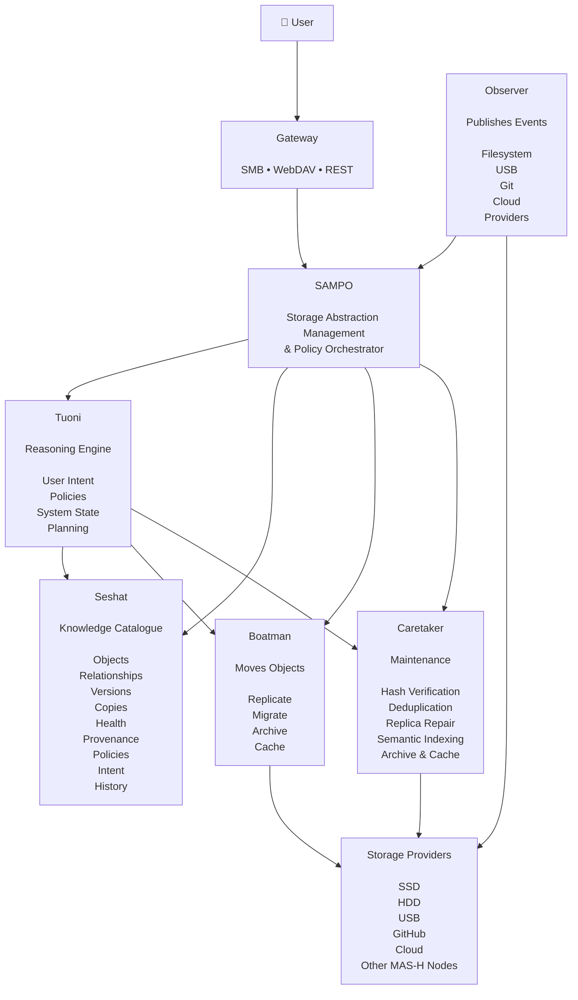

# MAS-H

## Memory Abstraction Storage Hypervisor

### Storage Hypervisor with a Digital Librarian control plane

MAS-H abstracts heterogeneous storage providers and presents a unified library of objects, projects, and relationships to users. It preserves existing files, reduces human cognitive load, and orchestrates existing tools (Everything, Syncthing, Git, etc.) rather than replacing them.

The goal is not to invent yet another filesystem or NAS. The goal is to make physical storage irrelevant to the user.

---

## SAMPO

**SAMPO** stands for **Storage Abstraction Management and Policy Orchestrator**.

SAMPO is the reference storage engine for MAS-H. It turns user intent into storage operations while hiding the complexity of heterogeneous storage providers.

SAMPO itself does **not** store data. Instead, it coordinates a collection of specialised services called **Staff**, each with a single responsibility.

SAMPO also provides the event infrastructure that lets the Staff communicate cleanly. The Staff do not directly manage each other. They publish and consume events through SAMPO.

---

## SAMPO Staff Components

- **Tuoni** – the reasoning engine that interprets user intent, consults the catalogue, evaluates policies, and produces storage decisions. Tuoni never performs storage I/O directly.
- **Seshat** – the catalogue that holds system knowledge: objects, relationships, versions, copies, health, provenance, policies, intent, and history.
- **Boatman** – executes transfer plans created by Tuoni, including replication, migration, archiving, cache promotion, and cache eviction.
- **Observer** – monitors the outside world: filesystem changes, storage-provider availability, USB events, Git repos, cloud providers, and similar external changes. It publishes raw events.
- **Caretaker** – performs background maintenance when resources are idle: hash verification, deduplication, replica repair, health checks, thumbnail generation, semantic indexing, archive and cache maintenance.
- **Gateway** – provides familiar interfaces such as SMB, WebDAV, and HTTP/REST for users and applications. It translates user requests into SAMPO operations.

---

## High-Level Architecture



---

## Design Principles

- Storage is an implementation detail.
- Search comes before folders.
- Users express intent, not implementation.
- MAS-H never makes data less accessible.
- Existing open-source tools are orchestrated, not replaced.
- Optimise human time before machine time.
- The system should feel like a librarian, not a storage admin panel.
- The user should never need to remember which drive contains a file.
- The system should preserve ordinary files and ordinary filesystems.
- The architecture should remain understandable even if individual components move to different machines.

---

## Documentation

- [VISION.md](VISION.md)
- [MANIFESTO.md](MANIFESTO.md)
- [SAMPO.md](SAMPO.md)
- [NON_GOALS.md](NON_GOALS.md)

---

## Getting Started

### How to Compile and Run Locally

Follow these instructions to compile, run, and query the MAS-H system on your local machine:

#### Prerequisites
- **Go**: Ensure Go is installed (Go 1.16 or newer recommended). You can verify with `go version`.

#### Compilation
To compile the MAS-H control plane binary manually, run the following command from the repository root:
```bash
go build -o mash cmd/mash/main.go
```
This produces a compiled executable called `mash` in the root directory.

#### Running the System
We provide a convenient shell script that sets up necessary workspace folders, compiles the application, and starts the control plane with the default configuration:
```bash
./scripts/run.sh
```

Alternatively, you can start the compiled binary manually by passing the custom configuration file path:
```bash
./mash -config config.json
```

#### Running the Test Suite
To run all tests (including the new integration and API gateway tests), use:
```bash
go test -v ./...
```

#### Querying the REST API
Once the control plane is online, the Gateway HTTP server runs on the port specified in `config.json` (default: `8080`). You can interact with the system via standard REST endpoints using `curl` or any other HTTP client:

##### 1. List Registered Storage Providers
```bash
curl -i http://localhost:8080/providers
```

##### 2. List All Tracked Objects (Metadata Catalogue)
```bash
curl -i http://localhost:8080/objects
```

##### 3. Register a New Custom Object Metadata Record
```bash
curl -i -X POST http://localhost:8080/objects \
  -H "Content-Type: application/json" \
  -d '{
    "id": "my-document.txt",
    "hash": "e3b0c44298fc1c149afbf4c8996fb92427ae41e4649b934ca495991b7852b855",
    "projectId": "personal-docs",
    "metadata": {
      "note": "Registered manually via Gateway API"
    }
  }'
```

---

## Documentation

Read the individual documents to understand the vision, architecture, terminology, and design decisions before any code is written.

The best order is:

1. `VISION.md`
2. `MANIFESTO.md`
3. `OBJECT_MODEL.md`
4. `SAMPO.md`
5. `ARCHITECTURE.md`
6. `POLICIES.md`
7. `GLOSSARY.md`
8. `NON_GOALS.md`
9. `EVENTS.md`
10. `DECISIONS.md`
11. `PRIOR_ART.md`
12. `BUILDING_BLOCKS.md`

If something is unclear, add a note to `DECISIONS.md` rather than guessing.