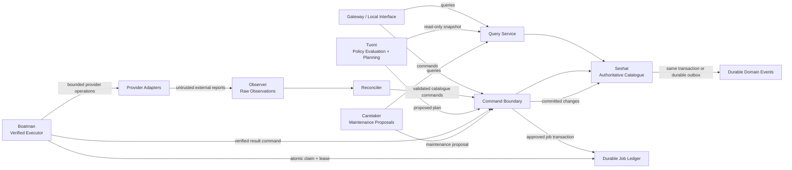
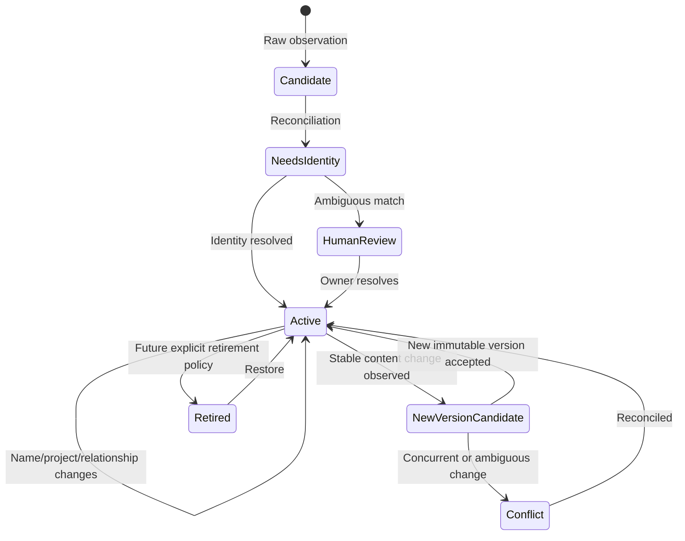
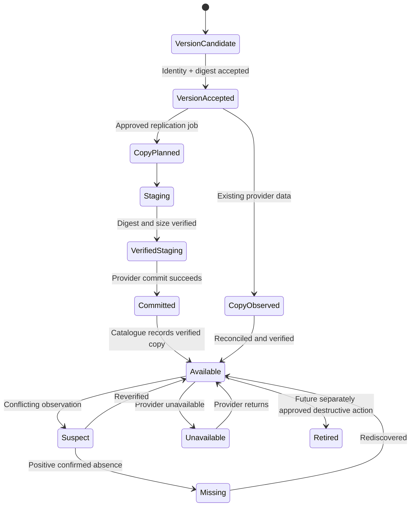
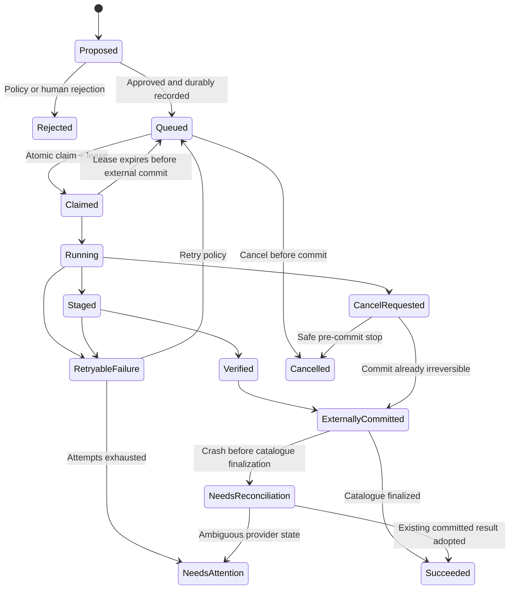

# MAS-H Great Reset: First Architecture Pass

Notation used below:

- **Source-derived** means stated or necessarily implied by the surviving documents.
- **Architectural inference** means a proposed consequence needed to make the source safe and implementable.
- **Owner decision** means the documents do not authorize choosing an answer yet.
- **First release** and **later** are kept distinct throughout.

No repository files were modified.

## 1. Executive verdict

The product vision is internally coherent at the constitutional level:

- Preserve ordinary user data and existing filesystems.
- Abstract storage location from human workflows.
- Treat knowledge, provenance, health, relationships, and policy as the product.
- Let users state intent while the system determines safe implementation.
- Prefer integration with proven tools.
- Optimize human attention.
- Keep AI optional.

These principles reinforce one another rather than conflict. [MANIFESTO.md — Principles and Laws](/D:/GIT/Mine/Mas-h/MANIFESTO.md:20) [Spec.md — Core Philosophy](/D:/GIT/Mine/Mas-h/Spec.md:35)

The vision is **not yet architecturally frozen**. Its central nouns exist, but their identities, authority, lifecycles, conflict rules, and destructive semantics remain undefined. The specification explicitly leaves several of these as research questions. [Spec.md — Objects](/D:/GIT/Mine/Mas-h/Spec.md:275) [Spec.md — Research Questions](/D:/GIT/Mine/Mas-h/Spec.md:493)

The safest interpretation is:

> MAS-H is an additive control plane over ordinary data. It may create verified additional copies and metadata, but it must not destructively reorganize existing data until accessibility, identity, authority, conflict, and deletion semantics are explicitly decided.

That is an **architectural inference from the First Law**, not a new product law.

The first release should therefore be a single-user, single-node, non-destructive catalogue and verified-replication system with genuine provider abstraction. It should not attempt automatic migration, deletion, cache eviction, deduplication, write-through filesystem presentation, or distributed coordination.

---

## 2. Document authority and stale-content report

### Authority

1. [MANIFESTO.md](/D:/GIT/Mine/Mas-h/MANIFESTO.md:1) is constitutional.
2. [Spec.md](/D:/GIT/Mine/Mas-h/Spec.md:1) defines vocabulary, vision, proposed boundaries, and open research.
3. [README.md](/D:/GIT/Mine/Mas-h/README.md:1) is explanatory only and cannot settle an ambiguity in the first two documents.

### README disposition

| README area | Status | Reason |
|---|---|---|
| Product summary and goals | Retain provisionally | Consistent with Manifesto and Spec. [README.md — introduction](/D:/GIT/Mine/Mas-h/README.md:1) |
| SAMPO definition | Provisional component proposal | Useful vocabulary, but neither its ownership nor its process boundary is settled by higher-authority documents. [README.md — SAMPO](/D:/GIT/Mine/Mas-h/README.md:13) |
| Staff descriptions | Provisional boundary proposal | Broadly consistent with the Spec, but not authority for packages, processes, goroutines, protocols, or deployment. [README.md — SAMPO Staff Components](/D:/GIT/Mine/Mas-h/README.md:25) |
| Architecture diagram | Provisional and internally inconsistent | It says Staff communicate through SAMPO, while the diagram also shows direct Tuoni-to-Staff relationships. [README.md — High-Level Architecture](/D:/GIT/Mine/Mas-h/README.md:36) |
| Design principles | Retain as summary only | Mostly duplicates higher-authority laws. [README.md — Design Principles](/D:/GIT/Mine/Mas-h/README.md:134) |
| Links to deleted documents | Quarantine | `VISION.md`, `SAMPO.md`, and `NON_GOALS.md` do not exist. [README.md — Documentation](/D:/GIT/Mine/Mas-h/README.md:149) |
| Go prerequisite and build command | **Stale implementation debris** | No implementation or selected language exists. [README.md — Prerequisites](/D:/GIT/Mine/Mas-h/README.md:164) |
| `cmd/mash`, `scripts/run.sh`, and `config.json` instructions | **Stale implementation debris** | All refer to deleted artifacts and must not influence the reset. [README.md — Compilation and Running](/D:/GIT/Mine/Mas-h/README.md:167) |
| Existing test-suite claims | **Stale implementation debris** | No test suite currently exists. [README.md — Running the Test Suite](/D:/GIT/Mine/Mas-h/README.md:185) |
| Port 8080 and REST endpoints | **Stale implementation debris** | These are obsolete runtime claims, not approved API decisions. [README.md — Querying the REST API](/D:/GIT/Mine/Mas-h/README.md:191) |
| Old documentation order and `DECISIONS.md` instruction | **Stale implementation debris** | It references nine absent documents and a deleted decision process. [README.md — Documentation order](/D:/GIT/Mine/Mas-h/README.md:220) |

The technology names in the Spec—MergerFS, SQLite, Samba, Everything, Syncthing, Git, and object storage—are research candidates, not selected dependencies. [Spec.md — Existing Technologies](/D:/GIT/Mine/Mas-h/Spec.md:467)

---

## 3. Classified requirement inventory

The documents do not define an explicit MVP. Items marked “MVP requirement” below are requirements that must hold in any first release capable of claiming compliance with the laws.

| ID | Meaningful claim | Classification | Disposition |
|---|---|---|---|
| M1 | MAS-H accepts existing storage as it is. | **LAW / PRODUCT GOAL** | Architectural inputs must be additive and tolerant of pre-existing organization. [Manifesto — opening](/D:/GIT/Mine/Mas-h/MANIFESTO.md:5) |
| M2 | Users should not need to remember file location. | **PRODUCT GOAL** | Search and logical organization must eventually hide placement. [Manifesto](/D:/GIT/Mine/Mas-h/MANIFESTO.md:14) |
| M3 | MAS-H must never make data less accessible. | **LAW** | Dominates every destructive or relocative feature. [Manifesto — First Law](/D:/GIT/Mine/Mas-h/MANIFESTO.md:22) |
| M4 | Data must survive MAS-H removal as ordinary files. | **LAW / MVP REQUIREMENT** | No proprietary data representation or mandatory runtime layer. [Manifesto — First Law](/D:/GIT/Mine/Mas-h/MANIFESTO.md:24) |
| M5 | Users express intent; the Librarian chooses implementation. | **LAW** | Policy and execution must be distinct. [Manifesto — Second Law](/D:/GIT/Mine/Mas-h/MANIFESTO.md:30) |
| M6 | Existing tools should be orchestrated first. | **LAW** | Every new subsystem needs a build-versus-integrate decision. [Manifesto — Third Law](/D:/GIT/Mine/Mas-h/MANIFESTO.md:50) |
| M7 | Human time is the primary optimization target. | **LAW** | Explainability, recovery, and search outrank micro-optimization. [Manifesto — Fourth Law](/D:/GIT/Mine/Mas-h/MANIFESTO.md:60) |
| M8 | Providers are resources, not identities. | **LAW** | Object identity cannot be a path, drive letter, bucket, or provider key. [Manifesto — Fifth Law](/D:/GIT/Mine/Mas-h/MANIFESTO.md:74) |
| M9 | Hypervisor supplies infrastructure; Librarian supplies judgment. | **PROPOSED COMPONENT BOUNDARY** | Needs ownership and command boundaries before implementation. [Manifesto](/D:/GIT/Mine/Mas-h/MANIFESTO.md:96) |
| S1 | Physical storage should become irrelevant to users. | **PRODUCT GOAL / FUTURE ASPIRATION** | Directional, not a falsifiable first-release claim. [Spec — Vision](/D:/GIT/Mine/Mas-h/Spec.md:5) |
| S2 | Applications believe they use ordinary files. | **AMBIGUOUS / FUTURE ASPIRATION** | Could mean direct files, generated views, WebDAV, SMB, or a virtual filesystem. [Spec — Elevator Pitch](/D:/GIT/Mine/Mas-h/Spec.md:17) |
| S3 | MAS-H is not a NAS, backup app, or cloud drive. | **PRODUCT POSITIONING / AMBIGUOUS** | It still performs replication and backup-like functions; the intended distinction must be articulated. [Spec — Elevator Pitch](/D:/GIT/Mine/Mas-h/Spec.md:25) |
| S4 | Knowledge about storage is the product. | **PRODUCT GOAL** | Catalogue, provenance, health, intent, and history are central. [Spec — Core Philosophy](/D:/GIT/Mine/Mas-h/Spec.md:35) |
| S5 | Existing filesystems remain intact and metadata can be rebuilt. | **LAW / MVP REQUIREMENT** | Requires recoverable identity and ordinary metadata strategy. [Spec — First Law](/D:/GIT/Mine/Mas-h/Spec.md:56) |
| S6 | MAS-H operates at file/object rather than block level. | **MVP REQUIREMENT / BOUNDARY** | Excludes block virtualization and filesystem replacement. [Spec — Storage Hypervisor](/D:/GIT/Mine/Mas-h/Spec.md:87) |
| S7 | Tuoni decides but performs no storage I/O. | **PROPOSED COMPONENT BOUNDARY** | Strong and useful separation. [Spec — Tuoni](/D:/GIT/Mine/Mas-h/Spec.md:145) |
| S8 | Seshat maintains catalogue knowledge. | **PROPOSED COMPONENT BOUNDARY** | “Maintains” does not yet identify exclusive write authority. [Spec — Seshat](/D:/GIT/Mine/Mas-h/Spec.md:159) |
| S9 | Boatman executes plans but does not create policy. | **PROPOSED COMPONENT BOUNDARY** | Executor must receive approved, bounded work. [Spec — Boatman](/D:/GIT/Mine/Mas-h/Spec.md:177) |
| S10 | Observer reports external changes but does not act. | **PROPOSED COMPONENT BOUNDARY / MVP REQUIREMENT** | Supports raw-observation separation. [Spec — Observer](/D:/GIT/Mine/Mas-h/Spec.md:189) |
| S11 | Caretaker performs opportunistic maintenance. | **FUTURE ASPIRATION** | Most listed tasks are too risky for the first release. [Spec — Caretaker](/D:/GIT/Mine/Mas-h/Spec.md:207) |
| S12 | Gateway may expose ordinary interfaces. | **FUTURE ASPIRATION / PROPOSED BOUNDARY** | No protocol has been selected. [Spec — Gateway](/D:/GIT/Mine/Mas-h/Spec.md:225) |
| S13 | Providers advertise capabilities. | **MVP REQUIREMENT** | A first release must prove different semantics, not wrap two directories identically. [Spec — Storage Providers](/D:/GIT/Mine/Mas-h/Spec.md:245) |
| S14 | Objects possess identity, hash, versions, copies, and history. | **PRODUCT GOAL / AMBIGUOUS** | Concepts are named but not separated adequately. [Spec — Objects](/D:/GIT/Mine/Mas-h/Spec.md:275) |
| S15 | Projects are logical and independent of directories. | **PRODUCT GOAL** | Membership cardinality and authority remain open. [Spec — Projects](/D:/GIT/Mine/Mas-h/Spec.md:307) |
| S16 | Policies express outcomes such as protection and placement. | **PRODUCT GOAL / AMBIGUOUS** | Scope, precedence, conflicts, and satisfiability are undefined. [Spec — Policies](/D:/GIT/Mine/Mas-h/Spec.md:333) |
| S17 | Search is primary; folders are secondary. | **PRODUCT GOAL / MVP REQUIREMENT** | A useful first release needs catalogue search even without filesystem presentation. [Spec — Search First](/D:/GIT/Mine/Mas-h/Spec.md:355) |
| S18 | AI-assisted search is optional; correct operation cannot require AI. | **MVP REQUIREMENT** | All correctness, recovery, and ordinary search paths must be deterministic. [Spec — Search First](/D:/GIT/Mine/Mas-h/Spec.md:375) |
| S19 | MAS-H is distributed and Staff can move between machines. | **FUTURE ASPIRATION / AMBIGUOUS** | Logical distribution is valuable; physical distribution is not a first-release requirement. [Spec — Distributed Architecture](/D:/GIT/Mine/Mas-h/Spec.md:381) |
| S20 | Every Staff member communicates through events. | **PROPOSED BOUNDARY / AMBIGUOUS** | Literal event-only communication conflicts with explicit query/command semantics. [Spec — Event Driven](/D:/GIT/Mine/Mas-h/Spec.md:419) |
| S21 | Maintenance occurs when idle and never interferes with work. | **FUTURE ASPIRATION / AMBIGUOUS** | “Idle” and interference budgets are undefined. [Spec — Maintenance Philosophy](/D:/GIT/Mine/Mas-h/Spec.md:435) |
| S22 | Named existing technologies may be reused. | **RESEARCH QUESTION** | None is an approved dependency. [Spec — Existing Technologies](/D:/GIT/Mine/Mas-h/Spec.md:467) |
| S23 | Prior art, catalogue model, relationships, canonical roles, and failure modes need research. | **RESEARCH QUESTION** | These explicitly prevent architectural freeze. [Spec — Research Questions](/D:/GIT/Mine/Mas-h/Spec.md:493) |
| R1 | SAMPO is a storage-policy orchestrator that owns no user data. | **PROPOSED COMPONENT BOUNDARY / AMBIGUOUS** | Useful working definition, subject to owner approval. [README — SAMPO](/D:/GIT/Mine/Mas-h/README.md:13) |
| R2 | SAMPO provides event infrastructure and Staff communicate through it. | **PROPOSED BOUNDARY / AMBIGUOUS** | Must not imply an in-memory event bus or event-only APIs. [README — SAMPO](/D:/GIT/Mine/Mas-h/README.md:19) |
| R3 | Go commands, scripts, config, tests, port, and endpoints exist. | **STALE IMPLEMENTATION DEBRIS** | Quarantine completely. [README — Getting Started](/D:/GIT/Mine/Mas-h/README.md:158) |
| R4 | Deleted architecture documents remain authoritative reading. | **STALE IMPLEMENTATION DEBRIS** | Quarantine; those files no longer exist. [README — Documentation order](/D:/GIT/Mine/Mas-h/README.md:220) |

---

## 4. Contradiction and ambiguity register

| Issue | Why it matters and what guessing could break | Smallest owner decision |
|---|---|---|
| **What does “accessible” mean?** The First Law is absolute, while archive, migration, eviction, and deduplication can reduce immediacy, redundancy, discoverability, or tool compatibility. [Manifesto — First Law](/D:/GIT/Mine/Mas-h/MANIFESTO.md:22) [Spec — Maintenance](/D:/GIT/Mine/Mas-h/Spec.md:435) | An implementer could equate “one copy still exists” with accessibility and silently move a local file to offline storage. | Define accessibility dimensions and whether explicit user-approved degradation is permitted. |
| **Ordinary files versus invisible storage** [Spec — First Law](/D:/GIT/Mine/Mas-h/Spec.md:56) [Spec — Vision](/D:/GIT/Mine/Mas-h/Spec.md:5) | A virtual namespace may hide provider paths but become a mandatory access dependency, violating removal safety. | Decide whether the long-term ordinary-file interface is a convenience projection or the primary write path. |
| **“Applications believe ordinary files” has several meanings.** [Spec — Elevator Pitch](/D:/GIT/Mine/Mas-h/Spec.md:17) | Choosing SMB, WebDAV, VFS, links, or direct paths changes locking, rename, conflict, offline, and security architecture. | Select the first-release user interaction and defer or select the eventual write-through presentation model. |
| **Metadata rebuild versus stable logical identity** [Spec — First Law](/D:/GIT/Mine/Mas-h/Spec.md:56) [Spec — Objects](/D:/GIT/Mine/Mas-h/Spec.md:275) | If identity, project membership, relationships, and canonical roles exist only in a lost catalogue, reconstruction cannot preserve the logical library. | Decide which portable metadata may be written alongside or into provider-native metadata. |
| **Object identity versus hash** [Spec — Objects](/D:/GIT/Mine/Mas-h/Spec.md:275) | Content hashes change with versions and collapse unrelated identical files if used as logical identity. Paths change and collide. | Approve stable generated logical IDs, separate version IDs, and separate content hashes—or specify another model. |
| **External rename/edit semantics are undefined.** [Manifesto — opening](/D:/GIT/Mine/Mas-h/MANIFESTO.md:5) [Spec — Observer](/D:/GIT/Mine/Mas-h/Spec.md:189) | A rename could be mistaken for deletion plus creation; an external edit could be overwritten or ignored. | Define when external changes create versions, conflicts, aliases, or new objects. |
| **Canonical status is underdefined.** [Spec — Core Philosophy](/D:/GIT/Mine/Mas-h/Spec.md:35) [Spec — Policies](/D:/GIT/Mine/Mas-h/Spec.md:333) | Treating canonical as “the only truth” risks unavailability; treating it as “preferred” changes failover behavior. | Define canonical scope, authority, failover, and whether status applies to object, version, or copy. |
| **Providers are “interchangeable,” but their guarantees differ.** [Spec — Storage Providers](/D:/GIT/Mine/Mas-h/Spec.md:245) | Assuming equivalence can turn eventual consistency, lack of atomic rename, or unavailable deletion into corruption. | Confirm that “interchangeable” means contract-addressable, not capability-equivalent. |
| **Event-only communication conflicts with queries and commands.** [Spec — Event Driven](/D:/GIT/Mine/Mas-h/Spec.md:419) | Treating commands, observations, and committed facts as the same event type creates accidental authority and unreliable correctness. | Reinterpret “event driven” as durable domain-event recording, while allowing explicit queries and commands. |
| **Tuoni “coordinates every component” while Staff have one responsibility.** [Spec — Tuoni](/D:/GIT/Mine/Mas-h/Spec.md:145) [Spec — Event Driven](/D:/GIT/Mine/Mas-h/Spec.md:419) | Coordination could become direct imperative control, policy ownership, or a monolithic god object. | Define Tuoni narrowly as pure planner versus broader workflow orchestrator. |
| **Observer detects “events,” but raw observations are not committed facts.** [Spec — Observer](/D:/GIT/Mine/Mas-h/Spec.md:189) | A transient missing-list result could otherwise become an authoritative deletion. | Approve a distinct untrusted observation type and reconciliation step. |
| **MAS-H is “not backup,” yet keeps copies and validates backups.** [Spec — Elevator Pitch](/D:/GIT/Mine/Mas-h/Spec.md:17) [Spec — Maintenance](/D:/GIT/Mine/Mas-h/Spec.md:435) | Ambiguous positioning can distort scope and user expectations about recovery guarantees. | State whether MAS-H coordinates protection but is not itself a backup repository, and what guarantees it advertises. |
| **Search-first versus filesystem presentation** [Spec — Search First](/D:/GIT/Mine/Mas-h/Spec.md:355) [Spec — Gateway](/D:/GIT/Mine/Mas-h/Spec.md:225) | Implementers may build a filesystem gateway before proving the catalogue or search experience. | Confirm search/catalogue as the first interface and filesystem presentation as later. |
| **Projects are independent of directories, but membership semantics are absent.** [Spec — Projects](/D:/GIT/Mine/Mas-h/Spec.md:307) | Guessing one-project-per-object would recreate folder limitations; allowing arbitrary overlap affects policy conflicts. | Decide membership cardinality and policy inheritance. |
| **Maintenance “when idle” is not operationally defined.** [Spec — Maintenance Philosophy](/D:/GIT/Mine/Mas-h/Spec.md:435) | Workers may compete with foreground work or never run. | Defer maintenance or define user-visible resource budgets and preemption. |
| **MAS-H/MASH naming differs.** [MANIFESTO.md](/D:/GIT/Mine/Mas-h/MANIFESTO.md:1) [Spec.md](/D:/GIT/Mine/Mas-h/Spec.md:1) | Low architectural risk, but identifiers, file formats, APIs, and package names need one canonical spelling. | Select canonical product and machine identifier spelling. |

---

## 5. Blocking product-owner questions

These must be answered before implementation architecture is frozen:

1. **Accessibility:** What exact dimensions constitute “not less accessible”—physical presence, ordinary-tool readability, latency, locality, discoverability, redundancy, permissions, and cost?
2. **Destructive consent:** Can an explicit user command authorize reduced accessibility, and if so, which operations still remain forbidden?
3. **Logical identity:** Are two byte-identical files imported from different contexts one logical object, two objects sharing content, or a user-mediated decision?
4. **Identity persistence:** May MAS-H write portable sidecars or provider-native metadata so object identity and relationships survive catalogue loss?
5. **External change:** Does an ordinary-tool edit create a new immutable version automatically? Is a rename the same object, and how confidently must it be recognized?
6. **Canonical semantics:** Is canonical status a preferred read source, an authoritative version lineage, or an exclusive authoritative copy?
7. **Projects and relationships:** Can objects belong to multiple projects, and do project policies combine, override, or conflict?
8. **First workflow:** What is the smallest user journey—discover, search, inspect health, request a copy, and verify completion—and through what local interface?
9. **Provider proof:** Which two semantically different provider classes must the first release support?
10. **First-release user/security model:** Is it explicitly single-user and local-only, or must permissions and multiple principals exist from the start?
11. **Policy approval:** Are first-release plans advisory until manually approved, or may non-destructive replication execute automatically?
12. **SAMPO meaning:** Is SAMPO the whole control plane, an orchestration module within MAS-H, a deployable process, or merely the reference implementation name?

The following can be deferred if explicitly excluded from release one:

- Multi-node conflict resolution.
- Write-through SMB/WebDAV/VFS behavior.
- Automated deletion, eviction, deduplication, tiering, and migration.
- AI and semantic search.
- Opportunistic maintenance scheduling.
- Full cloud-provider selection.
- Advanced relationship ontology.

---

## 6. Recommended defaults and alternatives

These are recommendations, not source-derived decisions.

| Question | Recommended default | Consequence | Main alternative |
|---|---|---|---|
| Accessibility | Preserve ordinary readability, discoverability, permissions, and at least the pre-existing durable copy unless the user explicitly authorizes otherwise. | First release is additive and cannot silently relocate source data. | Define accessibility only as recoverable bytes; simpler but much weaker than the Manifesto’s ordinary-tool promise. |
| Destructive consent | No destructive automation in release one. Later destructive commands require an explicit plan, fresh safety proof, retention window, and recoverable disposition. | Slower optimization, dramatically safer foundation. | Permit immediate delete after replica-count checks; unsafe under stale observations. |
| Logical identity | Stable generated object identity independent of path, provider, and content. Identical bytes may back multiple objects. | Preserves context and rename stability; deduplication remains a storage optimization. | Content-addressed logical objects; simpler deduplication but collapses distinct human meanings. |
| Version identity | Immutable generated version ID plus one or more immutable content digests. | Identity remains algorithm-independent and can represent metadata or provenance distinctions. | Make the digest the version ID; elegant, but algorithm migration and compound objects become harder. |
| Portable identity | Allow non-invasive sidecars or provider-native metadata where supported; never require them for byte access. | Catalogue reconstruction can preserve more than hashes and names. | Central catalogue only; clean providers, but reset loses logical continuity. |
| External edits | A stable, fully observed content change creates a new version; MAS-H never reverts it automatically. Rename correlation uses durable identity metadata where available and otherwise remains a proposed match. | Ordinary tools remain authoritative participants. | Treat every changed path as a new object; safer inference but poor continuity. |
| Canonical | Canonical means preferred authoritative source for a particular version, not the only valid copy. Failover does not rewrite history. | Availability and authority remain distinct. | Exclusive canonical copy; conceptually simple but creates a dangerous single point of truth. |
| Projects | Many-to-many membership; policies combine through explicit precedence and report conflicts. | Supports projects independent of directories. | Single project ownership; simpler but contradicts the library metaphor. |
| First workflow | Local searchable catalogue plus direct links/locators to original ordinary files and manually approved replication. | Proves the Librarian without promising filesystem coherence. | Start with SMB/WebDAV; substantially increases correctness surface. |
| Provider proof | One ordinary hierarchical filesystem provider and one real non-filesystem/key-oriented provider with different commit and consistency semantics. | Forces a genuine abstraction. | Two local-directory adapters; quicker but proves almost nothing. |
| Security | Explicitly single-user, local-only first release; no unauthenticated network listener. | Defers principal and ACL mapping without creating an unsafe default. | Multi-user/network-first; requires identity, authorization, audit, and provider ACL decisions now. |
| Policy execution | Tuoni produces explainable plans; user approval creates jobs. Automatic execution may later be allowed for additive operations. | Makes policy errors visible during model formation. | Fully automatic replication; faster but hides planning defects. |
| SAMPO | Name the logical orchestration/control-plane boundary. It may initially be assembled in one process and owns control metadata, not user bytes. | Deployment can evolve without changing the domain. | Define it as a concrete service/process; prematurely couples architecture to deployment. |
| Product spelling | “MAS-H” for product presentation; a separately approved stable lowercase machine identifier later. | Avoids leaking branding punctuation into storage formats prematurely. | Normalize everything to MASH. |

---

## 7. Non-negotiable architectural invariants

### Source-derived invariants

| Invariant | Architectural consequence | Falsifiable acceptance test | Failure scenarios | Prohibited or controlled operations |
|---|---|---|---|---|
| **Data never becomes less accessible.** [Manifesto — First Law](/D:/GIT/Mine/Mas-h/MANIFESTO.md:22) | Until accessibility is defined, automation may only add verified copies and metadata. | Import a provider, perform every first-release operation, remove MAS-H, and verify all pre-existing data remains readable at its original ordinary location. | Failed migration, bad policy, stale replica count, lost catalogue. | Delete, truncate, overwrite, destructive rename, eviction, source retirement. |
| **Files remain ordinary files.** [Spec — First Law](/D:/GIT/Mine/Mas-h/Spec.md:56) | Committed filesystem copies use provider-native ordinary representations; internal staging is never the sole copy. | Open committed data using an ordinary provider-native tool with MAS-H stopped. | Proprietary container, encrypted manifest without export path, mandatory mount service. | Proprietary storage formats as the only representation. |
| **Existing filesystems remain intact.** [Spec — First Law](/D:/GIT/Mine/Mas-h/Spec.md:56) | MAS-H operates through supported provider operations and does not reformat, repartition, or seize ownership. | Register and unregister a provider; filesystem structure and existing data remain usable. | Setup, migration, metadata placement. | Formatting, repartitioning, opaque root takeover. |
| **Catalogue loss does not block byte access.** [Spec — First Law](/D:/GIT/Mine/Mas-h/Spec.md:56) | Catalogue is a control-plane dependency, never a data-decoding dependency. | Destroy only MAS-H metadata and read every underlying committed file directly. | Database loss or corruption. | Requiring catalogue keys or locators to decode ordinary filesystem data. |
| **Catalogue should be reconstructible where possible.** [Spec — First Law](/D:/GIT/Mine/Mas-h/Spec.md:56) | Provider enumeration and portable identity/provenance metadata need an explicit recovery design. | Rebuild an empty catalogue from providers and recover bytes, copies, hashes, names, and every identity field promised as reconstructible. | Database loss, provider remount, partial metadata loss. | Claiming full reconstruction for state stored only centrally. |
| **Users express intent, not placement mechanics.** [Manifesto — Second Law](/D:/GIT/Mine/Mas-h/MANIFESTO.md:30) | Policy requests produce inspectable plans; executors receive concrete approved jobs. | Submit “keep three copies”; verify the user is not required to name destinations unless constraining policy. | Policy conflict, insufficient providers. | Boatman inventing placement or policy. |
| **Providers are not object identities.** [Manifesto — Fifth Law](/D:/GIT/Mine/Mas-h/MANIFESTO.md:74) | Logical and version IDs remain stable through provider moves and remounts. | Move a verified copy to a different provider and confirm object/version identity remains unchanged. | Drive-letter changes, bucket migration, provider rename. | Global IDs derived solely from paths, drive letters, bucket keys, or provider IDs. |
| **Existing tools are preferred.** [Manifesto — Third Law](/D:/GIT/Mine/Mas-h/MANIFESTO.md:50) | Each major subsystem requires prior-art review and an explicit integration decision. | For every selected subsystem, an architectural decision records evaluated existing tools. | Search, transfer, sync, filesystem presentation. | Reimplementing a mature tool without recorded justification. |
| **Human time outranks machine time.** [Manifesto — Fourth Law](/D:/GIT/Mine/Mas-h/MANIFESTO.md:60) | Plans, failures, health, and recovery must be explainable and searchable. | A user can determine what happened, why, current safety, and next action without inspecting internal storage. | Partial transfer, unavailable provider, policy conflict. | Silent retries, opaque policy decisions, unexplained destructive work. |
| **AI is optional.** [Spec — Search First](/D:/GIT/Mine/Mas-h/Spec.md:355) | Identity, matching, integrity, policy, recovery, and baseline search are deterministic. | Disable every AI integration and run all safety and core workflow tests successfully. | Offline use, model outage, unsupported hardware. | AI deciding correctness, deletion safety, or sole identity matching. |

### Necessary safety inferences

These are not explicit laws, but the First Law cannot be implemented without them:

1. **Raw observations are untrusted.** A missing listing, rename hint, or cloud notification cannot directly mutate authoritative truth.
2. **External work is durable before execution.** Every write has a durable job, preconditions, idempotency key, and audit trail.
3. **A copy becomes authoritative only after verified commit.** Planned, staged, and partially written data do not count toward protection.
4. **Destructive decisions require fresh positive evidence.** Absence of evidence is never evidence that deletion is safe.
5. **Caches never satisfy durable-retention guarantees unless explicitly promoted and verified as durable copies.**
6. **Migration is a multi-step workflow:** verified replication first; source retirement is a later, separately authorized destructive action.

### Operation-specific safety gates

| Operation | Minimum future gate |
|---|---|
| Overwrite | Verified replacement staged separately; destination identity and expected prior version checked; atomic conditional commit or refusal. |
| Migration | Destination verified and catalogued; source remains intact; separate retirement decision after fresh health check. |
| Eviction | Copy is explicitly a cache; durable-copy policy remains satisfied using fresh verified state. |
| Deduplication | Byte equality verified; logical objects remain distinct; replacement access path proven; recovery/undo window exists. |
| Rename | Provider supports safe rename or create-verify-switch; collision and case normalization checked; identity preserved separately from name. |
| Canonical change | New canonical copy verified and readable; decision recorded; old canonical not deleted as part of the same transition. |
| Deletion | Not in release one. Later: explicit authority, fresh inventory, retention/tombstone policy, protected-copy proof, and auditable result. |

---

## 8. Minimum safe first-release scope

### Include

1. **One local process**, explicitly single-user and local-only.
2. Clear logical modules, without microservices or a network broker.
3. A catalogue containing stable object identity, immutable versions, physical copies, provider records, observations, jobs, policies, and domain history.
4. Read-only discovery from registered providers.
5. Durable raw-observation ingestion and reconciliation.
6. Deterministic hashing and integrity verification.
7. Search by names, provider-visible metadata, project membership, hash, copy health, and identifiers.
8. Explainable manual policy/planning for an additive operation such as “create another verified copy.”
9. Durable, observable, retryable, idempotent transfer jobs.
10. One filesystem provider and one semantically different non-filesystem provider.
11. Verified create-new replication with safe staging and no destructive source action.
12. Recovery from process crash and catalogue loss, to the extent explicitly promised.
13. Direct ordinary-tool access to original provider data.
14. A local catalogue-oriented interface; its exact form remains an owner decision.

This scope proves the key claims in the First Law, provider abstraction, search-first design, and policy/execution separation. [Spec — First Law](/D:/GIT/Mine/Mas-h/Spec.md:56) [Spec — Storage Providers](/D:/GIT/Mine/Mas-h/Spec.md:245) [Spec — Search First](/D:/GIT/Mine/Mas-h/Spec.md:355)

### Exclude from release one

- Multi-node operation and distributed writes.
- AI or semantic search.
- Automatic tiering.
- Automatic migration.
- Any automatic delete or source retirement.
- Cache eviction.
- Physical deduplication.
- SMB, WebDAV, or virtual filesystem presentation.
- Write-through generated project views.
- Broad cloud orchestration beyond the one adapter needed to prove semantics.
- Opportunistic maintenance beyond explicitly scheduled verification jobs.
- Thumbnail generation and heavy indexing.
- Automatic canonical changes.

---

## 9. Conceptual component architecture

### Recommended flow

The proposed flow is sound once a reconciliation and authority boundary is added:



### Communication semantics

1. **Queries**  
   Read-only, side-effect-free views of committed catalogue state. They may be direct in-process calls in release one.

2. **Commands**  
   Explicit requests to change authoritative state or create work. Commands are validated against current state and preconditions.

3. **Durable jobs**  
   Approved, observable units of external work. A job exists before any write begins and has stable identity, retry policy, lease state, and result.

4. **Domain events**  
   Immutable facts emitted only after committed authoritative changes, such as `CopyVerified` or `JobFailed`. They are history and integration material, not the only correctness mechanism.

5. **Raw observations**  
   Untrusted claims such as “locator absent,” “file changed,” or “provider mounted.” They require reconciliation before affecting truth.

### Authority

- **Only Seshat’s command boundary may commit authoritative catalogue state.**
- Storage adapters are authoritative about the immediate result of their own operations, but their reports become catalogue truth only through validated commands.
- Observer never writes truth.
- Tuoni never performs provider I/O.
- Boatman never changes policy or invents a destination.
- Caretaker never directly deletes, repairs, or changes canonical state; it proposes or schedules bounded maintenance jobs.
- Gateway never directly mutates catalogue storage; it submits queries and commands.

### SAMPO

**Recommended interpretation:** SAMPO is the MAS-H control-plane/orchestration boundary. It owns:

- Catalogue/control metadata.
- Policies and intent.
- Observation records and reconciliation progress.
- Durable jobs, leases, and execution history.
- Domain events and audit history.
- Provider registrations and capability declarations.
- Planning and orchestration rules.

It does **not** own user bytes merely because it coordinates them. In release one it may be assembled in a single process. It is not intrinsically a process, package, service mesh, or event broker. This interpretation is consistent with the README’s conceptual description but requires owner approval. [README — SAMPO](/D:/GIT/Mine/Mas-h/README.md:13)

---

## 10. Domain entity and ownership model

| Concept | Adequately defined? | Lifecycle and owner | Immutable versus mutable | Required rule | Owner decision remaining |
|---|---|---|---|---|---|
| **Logical object** | No | Proposed/discovered → identified → active → possibly retired. Seshat owns identity record. | ID immutable; names, memberships, relationships, current-version pointer mutable through history. | Stable identity independent of content, path, and provider. | Identical-content import and merge/split semantics. |
| **Immutable version** | Partial | Observed/proposed → hashed → accepted → available/suspect. Seshat owns record after reconciliation. | Version ID, object ID, content digests, size, and creation provenance immutable. | Belongs to exactly one logical object under recommended default. | Generated versus content-derived identity; metadata-only changes. |
| **Content hash** | Partial | Calculated and verified against bytes. | Algorithm and digest immutable as an assertion; additional digests may be appended. | Never used alone as logical object identity. | Required algorithms and trust in provider-native checksums. |
| **Provider-native locator** | No | Created/discovered → present → missing/unavailable → retired. Adapter interprets; Seshat records opaquely. | Opaque value should normally be immutable within a Copy record. | Meaningful only with a Provider ID; never exposed as global identity. | Whether a rename mutates a locator or creates a successor Copy record. |
| **Human-visible name** | No | Assigned, aliased, renamed, removed. | Mutable and contextual. | Not globally unique; normalization belongs to presentation/provider context. | Primary name, aliases, and rename behavior. |
| **Project membership** | Partial | Added/removed independently of physical movement. Seshat owns membership. | Membership facts are mutable and historized. | Recommended many-to-many. | Policy inheritance and conflict rules. |
| **Relationship** | Explicitly unresolved | Proposed → accepted → superseded/removed. | Relationship record identity immutable; status and validity historized. | Typed endpoints and provenance required. | Relationship ontology and directionality. |
| **Physical copy** | Partial | Observed/planned → staging → verified → available → suspect/unavailable → retired. | Copy ID, version ID, provider ID immutable; health and observed state mutable. | Exactly one version and provider-native locator; only verified copies count toward policy. | Whether independently discovered identical bytes become copies of an existing version. |
| **Canonical status** | No | Proposed → assigned → superseded/unavailable. | Assignment is a historized role, not mutation of bytes. | Scope must be a specific version/copy relationship. | Preferred versus exclusive authority and failover. |
| **Replica** | Partial | A verified durable Copy fulfilling redundancy intent. | Role may change; copy identity does not. | Must not imply lower integrity than canonical. | Whether all verified durable copies are peers. |
| **Cache** | No | Created → refreshed → stale → evictable. | Role and freshness mutable. | Never silently treated as durable retention. | Whether caches may serve reads when canonical is unavailable. |
| **Archive** | No | Created → verified → retained → restored/expired. | Retention facts historized. | Reduced immediacy must be explicit and cannot be the sole accessible copy without owner authorization. | Accessibility promise and retrieval SLA. |
| **Job** | Missing | Proposed → queued → claimed → running → committed/failed/cancelled/attention. Job ledger owns it. | Intent, idempotency key, source version, destination, and preconditions immutable; state/lease mutable. | External work requires a durable job before execution. | Approval and retention policy. |
| **Policy** | Partial | Draft → active version → superseded/disabled. Seshat owns declarations; Tuoni evaluates. | Each policy version immutable. | Conflicts and unsatisfied states must be explicit. | Scope, precedence, combining rules, approval. |
| **Observation** | Missing as distinct concept | Received → validated → reconciled/rejected/superseded. Observation ledger owns it. | Raw payload immutable; reconciliation disposition mutable. | Never directly becomes authoritative deletion or identity. | Retention and confidence model. |
| **Domain event** | Underdefined | Appended after committed state change. | Entire record immutable. | Describes a fact, not a request or external rumor. | Ordering scope and external publication needs. |

### Identity conclusion

A logical object should have a stable identity independent of both path and content.

A version should have its own immutable identity. Its content digest is an immutable assertion about bytes, not necessarily the version identifier itself.

That yields:

```text
Logical Object ID
  └── Version ID
        ├── Content digest(s)
        └── Physical Copy IDs
              └── Provider ID + opaque native locator
```

This is an **architectural recommendation** grounded in the Fifth Law and the Spec’s separation of identity, hash, versions, and copies. It still requires owner approval. [Manifesto — Fifth Law](/D:/GIT/Mine/Mas-h/MANIFESTO.md:74) [Spec — Objects](/D:/GIT/Mine/Mas-h/Spec.md:275)

---

## 11. Lifecycle diagrams

### Object lifecycle



No automatic retirement belongs in release one.

### Version and copy lifecycle



### Durable job lifecycle



---

## 12. Provider capability contract

A provider is identified by a stable MAS-H provider identity and exposes opaque native locators. Its capability declaration must describe guarantees and constraints, not merely booleans.

Capabilities should include support level, consistency model, limits, atomicity scope, name rules, and any preconditions.

| Capability | Meaning | Core behavior when absent |
|---|---|---|
| Enumerate | Discover native items and continuation state. | Provider cannot be fully scanned; known-locator or notification-only operation may remain possible. |
| Stat | Inspect identity hints, size, version token, timestamps, and health without reading all bytes. | Core may open/read when permitted; otherwise cannot verify availability cheaply. |
| Open/read | Stream bytes from a locator. | Item cannot count as an accessible MAS-H data copy. It may only be metadata. |
| Stage/write | Create data hidden or isolated from the final visible locator. | Provider cannot be a transfer destination. |
| Atomic commit/rename | Publish verified staging without exposing partial data. | Use immutable create-new locators only. If partial data cannot be isolated, provider is not a safe write target. |
| Delete | Remove a native item with defined semantics. | Destructive policies cannot target this provider. |
| Server-side copy | Copy without streaming through MAS-H, with verifiable result. | Fall back to read/write transfer if both capabilities exist. |
| Native versioning | Preserve provider-side generations. | MAS-H still maintains its own logical version semantics. Native versions are evidence, not identity. |
| Preserve timestamps | Retain native time metadata. | Record loss of fidelity; never fabricate preservation. |
| Preserve names/hierarchy | Represent human names and hierarchy faithfully. | Use explicit name mapping and report export limitations. |
| Content-addressing | Store or retrieve by digest. | Digest may optimize transfer but does not become logical object identity. |
| Free-space reporting | Estimate capacity. | Planner treats capacity as unknown and avoids promises based on it. |
| Health reporting | Supply provider-native diagnostics. | Core uses observed operation results and verification. |
| Notifications | Report changes or cursor-based updates. | Poll through enumeration where supported. If neither exists, external changes cannot be discovered automatically. |
| Conditional writes | Commit only if destination state matches an expected token or is absent. | Never replace existing locators; use unique destinations or require serialization and human review. |
| Leases/locks | Coordinate native mutations. | Core job leases still prevent normal duplication, but provider writes must be create-new and idempotent. |
| Removable/intermittent | Explicitly model temporary unavailability. | Do not translate unavailability into missing or deletion. |
| Eventual consistency | State when listings and reads may lag. | Use settling windows, direct locator checks, provider tokens, and “unknown” states; absence is weak evidence. |

### Provider rules

- A global Copy record contains `Provider ID + opaque locator`, never a universal filesystem path.
- Provider display names, mount points, endpoints, credentials, bucket names, and paths are adapter configuration—not object identity.
- Capability checks occur during planning and again immediately before execution.
- A plan that requires an unsupported guarantee is unsatisfiable, not “best effort.”
- Capability changes invalidate stale plans.
- Every adapter needs a common conformance and fault-injection test suite.
- “Interchangeable” means usable through a common semantic contract where capabilities permit, not equivalent behavior.

---

## 13. Transfer transaction and crash-recovery protocol

### Replication protocol

1. **Plan from committed state**  
   Tuoni reads a versioned catalogue snapshot and proposes source version, acceptable source copies, destination provider, intended role, required guarantees, and safety preconditions.

2. **Approve and persist**  
   A command validates the plan. In one durable transaction it records the immutable job, idempotency key, preconditions, and `JobQueued` domain event.

3. **Claim atomically**  
   Boatman claims the job using a compare-and-set state transition and renewable lease. Only the holder may advance it.

4. **Revalidate**  
   Before I/O, recheck:
   - Job approval and cancellation.
   - Policy relevance.
   - Provider capabilities.
   - Source copy availability.
   - Expected source version/digest/token.
   - Destination constraints and collisions.

5. **Open source conditionally**  
   Use a provider generation token or equivalent where available. Hash while streaming. If bytes differ from the planned version, stop and report a new raw observation.

6. **Create isolated staging**  
   Stage under a unique locator derived from the job/idempotency identity. Never truncate or overwrite the destination.

7. **Stream and verify**  
   Check byte count and digest. Prefer read-back verification or a provider checksum whose semantics are explicitly trusted.

8. **Resolve destination collision**  
   If the intended destination already exists:
   - Same verified content: adopt it idempotently where policy permits.
   - Different content: declare a conflict; do not overwrite.
   - Ambiguous content: stop for reconciliation.

9. **Commit safely**  
   Use atomic rename/commit or conditional create-if-absent. Without atomic commit, publish only a newly created immutable locator after verification. A provider unable to hide partial writes is not a safe destination.

10. **Post-commit verification**  
    Stat or reopen the committed locator and verify expected content and generation.

11. **Finalize catalogue**  
    Commit Copy creation, observed provider state, job success, and domain events atomically. Only now does the new copy count toward policy.

12. **Clean staging**  
    Remove abandoned staging only through a separate safe cleanup rule. Cleanup failure does not invalidate a verified committed copy.

### Idempotency

The idempotency key should cover at least:

- Operation type.
- Immutable source Version ID.
- Destination Provider ID.
- Intended copy role.
- Stable destination intent or generated locator namespace.
- Relevant plan/policy version.

A repeated execution must either adopt the same verified result or stop on conflict. It must never create an unbounded series of differently named copies without an explicit policy decision.

### Stale plans

Any changed source version, provider capability revision, destination token, policy version, canonical assignment, or cancellation state makes a plan stale. A stale plan returns to planning; Boatman may not reinterpret it.

### Cancellation

- Before external commit: stop safely and leave or clean isolated staging.
- During a provider call: request cancellation but wait for a known provider result.
- After external commit: do not pretend cancellation reversed the write. Finalize or reconcile the committed copy. Removal, if desired, is a new destructive job.

### Crash points

| Crash point | Recovery |
|---|---|
| Before durable job | No work is permitted to have started. |
| After job, before claim | Job remains queued. |
| While claimed, before staging | Lease expires; another worker reclaims. |
| During staging | New worker identifies staging through idempotency metadata, verifies, resumes, or quarantines it. |
| After verification, before commit | Reverify staging and plan preconditions, then commit or abort. |
| After provider commit, before catalogue update | Reconciliation finds the idempotency marker or exact locator, verifies bytes, and adopts the result. |
| After catalogue update | Job and copy are already authoritative; repeated finalization is idempotent. |
| State cannot be determined | Mark `NeedsAttention`; never overwrite, delete, or count the uncertain copy. |

---

## 14. First-Law threat model

| Scenario | Required behavior | Prohibited behavior | Recovery and resulting catalogue state | Human intervention |
|---|---|---|---|---|
| Power loss during transfer | Source remains intact; partial data remains isolated; job recoverable. | Publishing or counting partial staging. | Lease expires; staging is verified/resumed/removed. Job becomes queued, succeeded, or needs attention. | Only if provider state is ambiguous. |
| Catalogue/database loss | Ordinary files remain readable; destructive work stops; reconstruction begins read-only. | Treating unknown copies as safe deletion candidates. | Re-enumerate providers and recover promised portable metadata. Unknown relationships remain explicitly unresolved. | Required for ambiguous identity/canonical/project recovery. |
| Corrupted catalogue | Enter safe read-only mode and validate against backups/providers. | Continuing transfer, canonical change, or deletion from suspect state. | Restore trusted snapshot or rebuild; record uncertain facts as observations. | Usually required before write mode resumes. |
| Removable drive pulled during write | Mark provider unavailable, retain job, preserve source. | Mark all copies missing or retry destructively elsewhere without policy review. | On return, inspect staging and generation; resume or restart safely. | No, unless device identity is ambiguous or damaged. |
| Two workers execute one job | One valid claim; provider idempotency prevents conflicting commit. | Two overwrites or duplicate authoritative records. | Adopt one verified result; reconcile redundant staging. | Only on conflicting provider results. |
| Source changes after hash recorded | Stop transfer when token/digest differs and emit observation. | Copying mixed bytes or labeling them as the old version. | Plan becomes stale; reconcile change as a candidate new version. | Only if object/version matching is ambiguous. |
| Destination contains different data | Preserve it and report collision. | Truncation, overwrite, or silent alternate naming that changes user meaning. | Job becomes conflict/needs attention; catalogue records observation, not a copy. | Yes, unless policy explicitly permits generated distinct names. |
| Canonical provider unavailable | Mark availability unknown/unavailable and use another verified copy only under approved failover semantics. | Deleting replicas, silently rewriting lineage, or claiming data loss from one failed check. | Canonical assignment remains historized; availability changes; alternative reads are auditable. | If no verified alternative or authority is ambiguous. |
| Delete requested with stale replica count | Refuse until fresh positive verification and destructive authorization. | Counting planned, cached, unavailable, or eventually consistent copies. | No data change; deletion job remains rejected/stale. | Possibly, especially for override. |
| Archive provider is eventually consistent | Treat negative listing as unknown during settling window; use direct locator/version checks. | Declaring archive missing from one list result or deleting source immediately after an unconfirmed write. | Copy stays pending/unknown until positive verification. | If consistency deadline expires ambiguously. |
| Two MAS-H nodes observe conflicting changes | Preserve both observations; perform no destructive resolution. | Last-writer-wins overwrite without an ownership protocol. | Conflict state with both candidate versions. Multi-node writes remain out of release one. | Yes until distributed authority is designed. |
| User edits files outside MAS-H | Preserve edit; observe and create a candidate version or conflict. | Reverting the file to catalogue state automatically. | Old version remains historical; new bytes are reconciled into a new version when identity is clear. | Only for ambiguous matching/conflict. |
| Provider renamed or remounted | Match stable provider identity independently from mount point; update configuration only after verification. | Creating a new provider identity solely because a path changed. | Provider becomes unavailable then returns with updated attachment information. | Required if stable identity cannot be proven. |
| Failed migration leaves partial destination | Keep source; partial destination remains isolated; migration is not complete. | Retiring source or counting partial destination. | Job retries or fails; catalogue retains source as available and destination as staging/unknown. | Only if cleanup or provider result is ambiguous. |
| Cache is the final surviving copy | Block eviction and raise a policy/safety violation. | Deleting it because its role says “cache.” | Reclassify only through explicit verified policy or create a durable replica first. | Required if retention intent is unclear. |
| External destination rename during commit | Detect generation/locator mismatch; stop or reconcile. | Updating the wrong file or recreating over the user’s rename. | Job becomes stale; renamed item appears as an observation. | Sometimes. |
| Case-insensitive collision | Adapter normalizes and reserves names before staging. | Assuming distinct case-sensitive names are representable. | Planner selects a non-conflicting representation or reports unsatisfiable plan. | If no reversible naming policy exists. |
| Provider rejects a name | Validate provider rules before transfer. | Repeated blind retries or lossy silent renaming. | Job becomes unsatisfiable/conflict; no copy is recorded. | Needed if user-visible naming must change. |
| Destination fills during write | Abort isolated stage; preserve source and existing destination. | Publishing truncated output or deleting source to create space. | Retry after capacity changes or replan to another provider. | Not normally. |
| Catalogue says copy exists but provider disagrees | Record a conflicting observation and verify directly. | Immediate deletion of records or other copies. | Copy becomes suspect/unknown until reconciled. | If disagreement persists. |

---

## 15. User-facing semantics

“Applications believe they are interacting with ordinary files” is an aspiration, not a selected interface. [Spec — Elevator Pitch](/D:/GIT/Mine/Mas-h/Spec.md:17)

| Interface | What it offers | Coherence burden | Release recommendation |
|---|---|---|---|
| Searchable catalogue UI | Search, project views, health, provenance, plans, and direct-open actions. | Low; primarily queries and explicit commands. | **First release.** |
| Direct original provider access | Ordinary tools continue using native files. | External edits and renames must be observed and reconciled. | **Mandatory escape hatch and first-release access path.** |
| Generated project views | Logical organization independent of source directories. | Link portability, stale views, rename behavior, and write semantics. | Later; read-only views first. |
| Links/materialized working sets | Familiar local working copies or references. | Symlink portability, duplicate ownership, synchronization, and lifecycle. | Later, after Copy semantics are stable. |
| WebDAV | Remote file-like interface. | Locking, conditional writes, partial PUT, rename, offline behavior, authentication. | Exclude from release one. |
| SMB | Broad ordinary-application compatibility. | Strong namespace, locking, ACL, case, rename, and durability semantics. | Exclude from release one. |
| Virtual filesystem | Most complete location illusion. | Kernel/filesystem correctness, caching, atomicity, crash behavior, availability. | Much later, if ever. |
| Write-through unified namespace | Applications edit logical objects directly. | Requires complete versioning, conflicts, canonical writes, leases, and failure semantics. | Requires a separate architecture decision after the control plane is proven. |

The first release should make original provider files easy to locate and open, while the catalogue supplies search and context. Removing MAS-H then removes convenience, not data access.

---

## 16. Suggested future document set

1. **MANIFESTO.md** — constitutional laws; change rarely.
2. **PRODUCT_SCOPE.md** — first release, future scope, and explicit non-goals.
3. **GLOSSARY.md** — normative distinctions among object, version, digest, copy, locator, canonical, cache, replica, archive, job, observation, and event.
4. **DOMAIN_MODEL.md** — identities, lifecycles, invariants, ownership, cardinality.
5. **ARCHITECTURE.md** — query, command, catalogue, planning, jobs, execution, reconciliation, and deployment boundaries.
6. **FIRST_LAW_SAFETY_MODEL.md** — accessibility definition and destructive-operation gates.
7. **PROVIDER_CONTRACT.md** — capabilities, guarantees, consistency, naming, fault semantics.
8. **TRANSFER_PROTOCOL.md** — transaction, idempotency, leases, staging, commit, cancellation, recovery.
9. **OBSERVATION_AND_RECONCILIATION.md** — external changes, confidence, conflicts, rename/edit behavior.
10. **POLICY_MODEL.md** — scope, precedence, satisfiability, plan approval, canonical semantics.
11. **RECOVERY.md** — catalogue loss, corruption, portable metadata, rebuild guarantees.
12. **THREAT_MODEL.md** — hostile failure scenarios and mitigations.
13. **USER_SEMANTICS.md** — search, projects, direct access, generated views, future gateways.
14. **NON_GOALS.md** — explicit first-release exclusions.
15. **ADRs/** — technology and architectural decisions, including build-versus-integrate research.
16. **TEST_STRATEGY.md** — invariant tests, provider conformance, crash injection, and recovery tests.
17. **README.md** — short entry point only, after stale implementation debris is removed in a separately authorized documentation pass.

---

## 17. Phased implementation plan

No implementation should start until Phase 0’s blocking decisions are approved.

### Phase 0 — Decision freeze

- Decide accessibility and destructive consent.
- Approve object/version/hash identity separation.
- Decide portable metadata and catalogue reconstruction promise.
- Decide external edit/rename semantics.
- Define canonical status.
- Confirm project membership and initial policy behavior.
- Select first workflow, security posture, provider classes, and SAMPO meaning.
- Publish glossary, domain model, MVP scope, safety model, and ADR process.

### Phase 1 — Read-only domain proof

- Establish domain behavior and invariant tests.
- Build provider conformance tests and fault models.
- Validate one filesystem and one non-filesystem provider contract.
- Implement read-only enumeration, opaque locators, observations, hashing, and catalogue queries.
- Demonstrate catalogue loss without loss of ordinary byte access.

### Phase 2 — Reconciliation and search

- Add durable observation ingestion.
- Implement identity resolution according to the approved rules.
- Handle external edits, renames, provider unavailability, and conflicts.
- Add deterministic catalogue search and project membership.
- Keep all provider interaction read-only.

### Phase 3 — Durable additive jobs

- Add durable planning, job states, claims, leases, idempotency, and recovery.
- Implement isolated staging and verified create-new replication.
- Add crash injection at every transfer step.
- Require manual approval.
- Keep source retirement and overwrite impossible.

### Phase 4 — Safety and recovery qualification

- Exercise the full First-Law threat model.
- Validate catalogue backup, corruption detection, and reconstruction.
- Add audit and human-readable job explanations.
- Prove duplicate-worker and eventual-consistency behavior.
- Establish provider certification levels based on guarantees.

### Phase 5 — Non-destructive policy automation

- Allow automatic creation of additional verified copies under tightly bounded policies.
- Add unsatisfied-policy reporting and deterministic plan explanations.
- Preserve manual approval for ambiguous destinations or naming conflicts.
- Do not introduce deletion, migration, or eviction.

### Phase 6 — Expanded providers and read-only views

- Add providers selected through prior-art research and ADRs.
- Add generated read-only project views if their staleness semantics are acceptable.
- Evaluate links or materialized working sets.
- Keep original provider access available.

### Phase 7 — Deferred advanced capabilities

Each requires a separate safety review:

- Multi-node authority and conflict handling.
- Write-through presentation.
- SMB/WebDAV/VFS.
- Automated canonical changes.
- Migration and source retirement.
- Cache eviction.
- Physical deduplication.
- Archive automation.
- Opportunistic scheduling.
- Semantic/AI search.

## Final verdicts

### A. Is the product vision coherent?

**Yes.** The laws form a strong, distinctive product constitution: an additive, humane, provider-neutral Librarian over ordinary data. The vision is more coherent than the surviving architecture details.

### B. Is there enough information to freeze an architecture?

**No.** There is enough information to freeze the broad safety shape—stable domain identity, ordinary data, provider adapters, authoritative catalogue commands, raw observations, pure planning, durable jobs, verified execution—but not enough to freeze the domain model or destructive semantics.

### C. Exact decisions required before implementation

1. Accessibility definition and permitted exceptions.
2. Destructive-consent boundary.
3. Logical object identity and identical-content import semantics.
4. Version identity versus content-hash semantics.
5. Portable metadata and reconstruction guarantee.
6. External edit, rename, and conflict behavior.
7. Canonical scope, authority, and failover.
8. Project membership and policy-combination rules.
9. First-release workflow and interface.
10. Two provider classes required to prove heterogeneity.
11. Single-user/local-only security scope.
12. Manual versus automatic approval for additive plans.
13. SAMPO’s precise ownership and naming boundary.
14. Canonical MAS-H/MASH product and machine spelling.